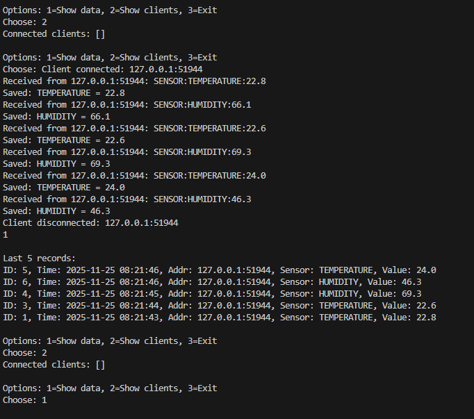

# 🚀 STM32 Manager с SQLite базой данных

## 📁 Структура проекта

```
trefi/
├── python_server/         # Python серверная часть
│   ├── main.py            # Главный файл сервера
│   ├── test_client.py     # Тестовый клиент
│   └── stm32_data.db      # База данных (создается автоматически)
├── src/
│   └── main.c             # Код для STM32
└── platformio.ini         # Конфигурация PlatformIO
```

## 🛠️ Быстрая установка

### 1. Создание файлов сервера

**main.py:**
```python
# -*- coding: utf-8 -*-
import socket
import sqlite3
import threading
import time

print("🎯 STM32 SERVER STARTING...")

# Create database
conn = sqlite3.connect('stm32_data.db', check_same_thread=False)
cursor = conn.cursor()
cursor.execute('''
    CREATE TABLE IF NOT EXISTS sensor_data (
        id INTEGER PRIMARY KEY AUTOINCREMENT,
        timestamp DATETIME DEFAULT CURRENT_TIMESTAMP,
        address TEXT,
        sensor_type TEXT,
        value REAL
    )
''')
conn.commit()
print("✅ DATABASE CREATED")

clients = {}
running = True

def handle_client(client_socket, address):
    client_id = f"{address[0]}:{address[1]}"
    clients[client_id] = client_socket
    print(f"🔌 CLIENT CONNECTED: {client_id}")
    
    try:
        while running:
            data = client_socket.recv(1024)
            if not data:
                break
                
            message = data.decode('utf-8').strip()
            print(f"📨 RECEIVED FROM {client_id}: {message}")
            
            # Save to database
            if message.startswith('SENSOR:'):
                parts = message.split(':')
                if len(parts) >= 3:
                    sensor_type = parts[1]
                    value = float(parts[2])
                    
                    cursor.execute(
                        "INSERT INTO sensor_data (address, sensor_type, value) VALUES (?, ?, ?)",
                        (client_id, sensor_type, value)
                    )
                    conn.commit()
                    print(f"💾 SAVED: {sensor_type} = {value}")
                    
    except Exception as e:
        print(f"❌ ERROR: {e}")
    finally:
        if client_id in clients:
            del clients[client_id]
        client_socket.close()
        print(f"🔌 CLIENT DISCONNECTED: {client_id}")

# Start server
server_socket = socket.socket(socket.AF_INET, socket.SOCK_STREAM)
server_socket.bind(('0.0.0.0', 8080))
server_socket.listen(5)
print("✅ SERVER STARTED ON PORT 8080")

# Accept connections in separate thread
def accept_connections():
    while running:
        try:
            client_socket, address = server_socket.accept()
            client_thread = threading.Thread(target=handle_client, args=(client_socket, address))
            client_thread.daemon = True
            client_thread.start()
        except:
            break

accept_thread = threading.Thread(target=accept_connections)
accept_thread.daemon = True
accept_thread.start()

print("🔄 SERVER IS RUNNING. PRESS CTRL+C TO STOP.")

try:
    # Simple menu
    while True:
        print("\n" + "="*50)
        print("🎮 SERVER CONTROL MENU")
        print("="*50)
        print("1️⃣  SHOW DATA")
        print("2️⃣  SHOW CLIENTS") 
        print("3️⃣  EXIT")
        print("="*50)
        
        choice = input("🎯 CHOOSE: ").strip()
        
        if choice == '1':
            cursor.execute("SELECT * FROM sensor_data ORDER BY timestamp DESC LIMIT 5")
            rows = cursor.fetchall()
            print("\n📊 LAST 5 RECORDS:")
            print("-" * 80)
            for row in rows:
                print(f"🆔 ID: {row[0]} | ⏰ TIME: {row[1]} | 📍 ADDR: {row[2]} | 📡 SENSOR: {row[3]} | 📈 VALUE: {row[4]}")
            print("-" * 80)
                
        elif choice == '2':
            clients_list = list(clients.keys())
            if clients_list:
                print(f"🔌 CONNECTED CLIENTS: {clients_list}")
            else:
                print("🔌 NO CONNECTED CLIENTS")
            
        elif choice == '3':
            break
            
        else:
            print("❌ INVALID CHOICE")
            
except KeyboardInterrupt:
    print("\n🛑 STOPPING SERVER...")
finally:
    running = False
    server_socket.close()
    conn.close()
    print("✅ SERVER STOPPED")
```



**test_client.py:**
```python
# -*- coding: utf-8 -*-
import socket
import time
import random

print("🧪 TEST CLIENT")

try:
    client = socket.socket(socket.AF_INET, socket.SOCK_STREAM)
    client.connect(('localhost', 8080))
    
    print("✅ CONNECTED TO SERVER!")

    for i in range(3):
        # Генерируем тестовые данные
        temp = 20 + random.random() * 10
        hum = 40 + random.random() * 30
        
        try:
            # Отправляем температуру
            message1 = f"SENSOR:TEMPERATURE:{temp:.1f}\n"
            client.send(message1.encode())
            print(f"📤 SENT: {message1.strip()}")
            time.sleep(0.5)
            
            # Отправляем влажность
            message2 = f"SENSOR:HUMIDITY:{hum:.1f}\n"
            client.send(message2.encode())
            print(f"📤 SENT: {message2.strip()}")
            time.sleep(1)
            
        except (BrokenPipeError, ConnectionAbortedError, ConnectionResetError):
            print("❌ CONNECTION LOST")
            break
            
    client.close()
    print("✅ TEST COMPLETED!")
    
except ConnectionRefusedError:
    print("❌ SERVER NOT RUNNING! START MAIN.PY FIRST")
except Exception as e:
    print(f"❌ ERROR: {e}")
```

## 🚀 Запуск системы

### 1. Запуск сервера
```bash
cd python_server
python main.py
```

### 2. Тестирование (в новом терминале)
```bash
cd python_server
python test_client.py
```

## 📊 Формат данных от STM32
```
SENSOR:TEMPERATURE:25.5
SENSOR:HUMIDITY:60.2
SENSOR:PRESSURE:1013.25
SENSOR:VOLTAGE:3.3
```

## ⚙️ Конфигурация STM32

**platformio.ini:**
```ini
[env:bluepill_f103c8]
platform = ststm32
board = bluepill_f103c8
framework = stm32cube
build_flags = -D STM32F103xB
```

## ✅ Возможности системы
- ✅ Прием данных от STM32 по сети
- ✅ Сохранение в SQLite базу (дата, адрес, тип сенсора, значение)
- ✅ Просмотр истории данных
- ✅ Многопоточная обработка подключений
- ✅ Консольное управление

## 🐛 Устранение неполадок

**Если ошибка кодировки:**
- Сохраните файлы в кодировке UTF-8
- Добавьте `# -*- coding: utf-8 -*-` в начало файлов

**Если порт занят:**
- Измените порт в main.py с 8080 на другой

**Если клиент не подключается:**
- Убедитесь что сервер запущен
- Проверьте что используете localhost или 127.0.0.1

---
*Это единый Markdown файл со всей документацией проекта*
